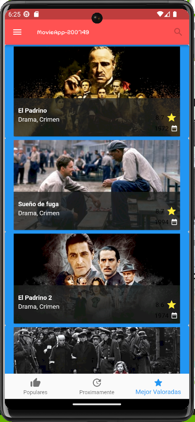
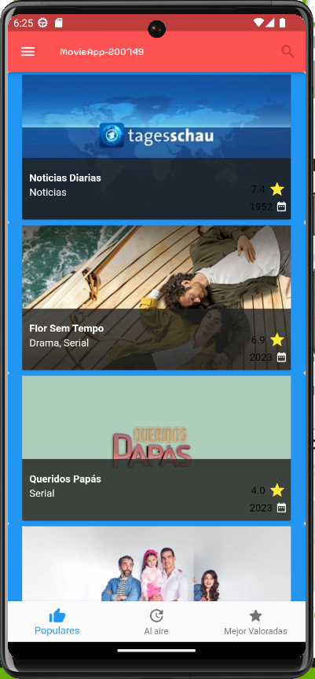

# DMI_PRACTICA7_200749

  
# Universidad Tecnológica de Xicotepec de Juárez

## Ingeniería en Desarrollo y Gestión de Software

## Desarrollo Movil Integral

## Marco Antonio Rosas Gonzalez
 
## 10° "A"

## Septiempre - Diciembre

## Descripción:  Dentro de este archivo, se encuentra la clase Home, que representa la página principal de la aplicación. En el método initState, se llama a la función _loadJson para cargar datos de medios, ya sean películas o programas de televisión, utilizando HttpHandler. Además, se define un estilo de fuente personalizado y se crea la estructura principal de la aplicación, que incluye una AppBar (Barra de Navegación Superior), un Drawer (Menú Lateral) y un BottomNavigationBar (Barra de Navegación Inferior).
## Menú Lateral (Drawer): El menú lateral se despliega deslizando desde el borde izquierdo de la pantalla o al tocar el icono de menú en la AppBar. Contiene las siguientes opciones:

"Películas": Esta opción muestra películas y utiliza un estilo de fuente personalizado para dar formato al texto.
"Programas de Televisión": Muestra programas de televisión y utiliza el mismo estilo de fuente personalizado.
"Cerrar": Permite cerrar el menú lateral y volver a la página de inicio.
Barra de Navegación Inferior (BottomNavigationBar): La barra de navegación inferior contiene tres elementos:

"Populares": Muestra medios populares, ya sean películas o programas de televisión, y presenta un ícono de pulgar hacia arriba.
"Próximos Estrenos": Muestra medios que están por estrenarse, ya sean películas o programas de televisión, y tiene un ícono de actualización.
"Mejor Valorados": Muestra medios mejor valorados, ya sean películas o programas de televisión, y cuenta con un ícono de estrella. Cada medio está calificado o valorado por los usuarios para ayudar a los usuarios a encontrar contenido de alta calidad.

&nbsp;
&nbsp;

&nbsp;
&nbsp;

 
 
